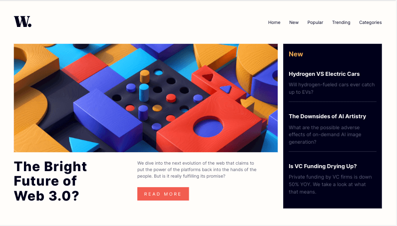
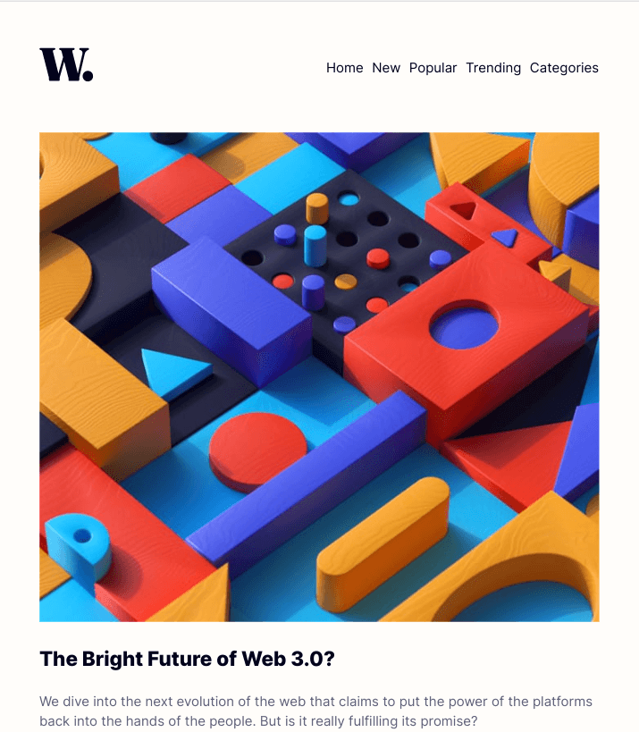

# Frontend Mentor - News homepage solution

This is a solution to the [News homepage challenge on Frontend Mentor](https://www.frontendmentor.io/challenges/news-homepage-H6SWTa1MFl). Frontend Mentor challenges help you improve your coding skills by building realistic projects. 

## Table of contents

- [Overview](#overview)
  - [The challenge](#the-challenge)
  - [Screenshot](#screenshot)
  - [Links](#links)
- [My process](#my-process)
  - [Built with](#built-with)
  - [What I learned](#what-i-learned)
  - [Continued development](#continued-development)
  - [Useful resources](#useful-resources)

## Overview

### The challenge

Users should be able to:

- View the optimal layout for the interface depending on their device's screen size
- See hover and focus states for all interactive elements on the page
- **Bonus**: Toggle the mobile menu (requires some JavaScript)

### Screenshot

### Links

- Live Site URL: [Github Pages](https://jdegand.github.io/news-homepage)

## My process

### Built with

- Semantic HTML5 markup
- CSS custom properties
- Flexbox
- CSS Grid
- Mobile-first workflow

### What I learned

I looked at many ways of doing the side-drawer and dimming the background.   

If you use transform to move the mobile menu off-screen, you create a new stacking context which will cause the backdrop to dim the menu.  Any z-index value you set on the menu will be ignored.  Playing with opacity also creates stacking context problems.  

You can use transform and get the backdrop to not overlap the menu if you limit the backdrop's width.  However, if you have an animation for the side drawer, the user will see that the backdrop does not cover the entire page.  You can add a timeout that matches the transition's length to negate that, but when the user closes the menu -  the backdrop will remain for the timeout's duration.   If you remove the transition animation, it looks harsh but matches design.  

You can toggle the mobile menu without js by using a checkbox, but that creates problems as the checked attribute can only be used in the css if the overlap is a descendant or sibling. :has selector can allow you to get around that - body:has(.checkbox:checked).  

You could add a backdrop class to the header and the body in the js script to change the background color.  This creates a problem as the intersection of the header and body shows a very noticeable line.  

You could also try using pseudo elements to dim the body when the menu is displayed.    

You can decide whether you will allow scrolling when the mobile menu is displayed or not.  To prevent scrolling, you add a class to the body giving it full width and height with no overflow allowed.  

CSS Layers may help with the z-index issues.

Problems come from having to set background color on the header.  Without a background set, the header collapses and without it, the background of the header prevents partial dimming of the header.  Need to assign a fixed height on the nav ? 

If you add href to mobile nav links, you have to account for header height if you are a using sticky header, otherwise link will overshoot the intended target.   

Tough to squeeze the whole desktop design on one page with no scroll.  I think it is better to have so portion of the bottom section rendered so user knows there is more content below.  Also, I did not use specified 15px font size but even that would not help much.  

Used closer spacing to design and made links in the navbar all point to the missing 3 stories below the fold.  

Alternated between having the grid be 3 and 4 columns.

1024px viewport could be adjusted to have either the laptop large design or the tablet design.  To squeeze desktop design, need to adjust grids and paddings.  

Adding font-weight guard to a font-face declaration should cause browser to use associated font - inspecting computed style - it failed to apply.  Unless [this article](https://www.hacksoft.io/blog/using-multiple-font-files-the-right-way) is wrong.

### Continued development

- Use a framework
- covert data-attribute implementation to class-based implementation

### Useful resources

- [Github](https://gist.github.com/DavidWells/18e73022e723037a50d6) - CSS Reset
- [LogRocket](https://blog.logrocket.com/create-responsive-mobile-menu-with-css-no-javascript/) - responsive mobile menu no js
- [Stack Overflow](https://stackoverflow.com/questions/28411499/disable-scrolling-on-body) - disable scrolling
- [Stack Overflow](https://stackoverflow.com/questions/60228488/mobile-menu-css-div-dim-visible-background-around-menu) - mobile menu dim visible background around menu
- [YouTube](https://www.youtube.com/watch?v=HbBMp6yUXO0) - Kevin Powell Mobile Nav
- [SoloDev](https://www.solodev.com/blog/web-design/how-to-make-the-ultimate-mobile-menu.stml) - make the ultimate mobile menu
- [Stack Overflow](https://stackoverflow.com/questions/60228488/mobile-menu-css-div-dim-visible-background-around-menu) - dim visible background around menu
- [Stack Overflow](https://stackoverflow.com/questions/10021302/how-to-apply-an-opacity-without-affecting-a-child-element-with-html-css) - opacity without affecting child elements?
- [HackSoft](https://www.hacksoft.io/blog/using-multiple-font-files-the-right-way) - multiple font files the right way
- [FreeCodeCamp](https://www.freecodecamp.org/news/4-reasons-your-z-index-isnt-working-and-how-to-fix-it-coder-coder-6bc05f103e6c/) - z-index troubleshooting
- [YouTube](https://www.youtube.com/watch?v=l6nmysZKHFU) - ReactJS - Build a Responsive Navigation Bar & Side Drawer Tutorial
- [Stack Overflow](https://stackoverflow.com/questions/1202425/making-the-main-scrollbar-always-visible) - making scrollbar always visible